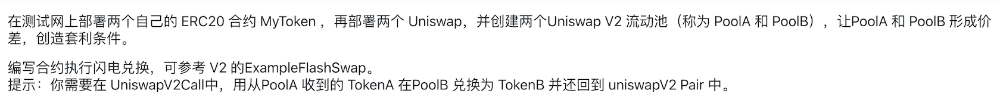

# UNI_V2 闪电兑换套利



## A. 闪电兑套利的逻辑

**A 资产**和 **B 资产**作为交易对，其中任一资产在**外部 DEX** 的价格低于**当前 DEX**（指 **Uniswap V2**） 的价格时，即存在套利空间。

**举例说明**：若 **ETH/DAI** 在 **外部 DEX** 和 **当前 DEX（UniswapV2）** 两个池子中的价格分别为 `2000:1` 和 `2200:1`。显然，**外部 DEX** 中的 ETH 价格更低，存在套利机会。

**闪电兑套利**充分使用了**闪电兑**的优势（“空手套白狼”），针对这个例子，其套利步骤如下：

1. **外层兑换的发起**：通过直接调用 **当前 DEX** 的 **UniswapV2Pair** 合约的 {**swap**} 方法（参数 `data` 不为空字节）发起兑换交易，并要求兑出<u>准确的</u> 2200 DAI（“**应投入的数量**”预计为 1 ETH 与手续费，可使用 **UniswapV2Library.getAmountsIn** 的返回的数组结果的第一个元素求得具体应投入的资产数量）；
2. **内层兑换与数量要求**（在回调方法  **{uniswapV2Call}** 中执行）：由于**闪电兑**的“**乐观转账**”，这 2200 DAI 会先发送给接收者（用户的合约），接收者（用户的合约）通过其内部实现的回调方法  **{uniswapV2Call}** “挪用”乐观转入的全额资产（2200 DAI） 在 **外部 DEX** 中兑换 **ETH**（**内层兑换**），并要求“**内层兑换**中兑出的 **ETH** 数量大于**外层兑换**中应投入的资产数额”（保证有套利空间）；
3. **归还“应投入的资产”**（在回调方法  **{uniswapV2Call}** 中执行）：将**内层兑换**兑出的 **ETH** 中的其中一部分“归还”给**外层兑换**（**UniswapV2Pair** 合约），“归还”的数量等于“**应投入的数量**”；
4. 若前一步“归还”的“应投入的资产”是足够的，则顺利通过“**投入量检查**”，**UniswapV2Pair** 合约在更新自己的两种资产的储备量之后，**外层兑换**结束；
5. 未被“归还”的 **ETH** 就是套利者所获得的利润，套利完成。

---

### 闪电兑套利的关键点

- **闪电兑套利**内置了一个“**内层兑换**”，用于通过价格偏低的资产兑出更多“组成交易对的另一种资产”，与“归还”给“**外层兑换**”的“**<a id="amountinrequired">应投入的数量</a>**”存在差异，以此获利。
- “**内层兑换**”与“**外层兑换**”的兑换方向始终是相反的。
- 最终套得的利润是以“与价格偏低的资产组合为交易对的另一种资产”的形式存在的。
- **风险**：若没有足够的“**应投入资产**”就会失败回滚整个交易。导致失败的因素包括滑点、资金不足或其他外部因素导致的无法“归还”或者“归还”不足，失败可能会产生额外的费用或损失；此外，市场套利行为的拥挤导致较高的 gas 费用使得套利者亏本。

<br />


## B. 闪电兑套利合约详解

```solidity
// SPDX-License-Identifier: MIT
pragma solidity ^0.8.19;

import "./uniswap_v2/v2-core/interfaces/IUniswapV2Callee.sol";
import "./uniswap_v2/v2-core/interfaces/IUniswapV2Pair.sol";
import "./uniswap_v2/v2-periphery/libraries/UniswapV2Library.sol";
import {Ownable} from "@openzeppelin/contracts/access/Ownable.sol";
import "@openzeppelin/contracts/token/ERC20/IERC20.sol";

contract FlashSwapArbitrage is Ownable, IUniswapV2Callee {
    address factory_UNIV2;	// 当前 DEX 的工厂合约地址
		
    // 事件：执行了套利
    event ArbitrageConducted(
        address indexed factory_TargetDEX, address indexed earnedAsset, uint256 indexed earnedAmount, address pairedAsset
    );
    // 事件：修改当前 DEX 的工厂合约的地址（匹配另一个不同的 DEX）
    event FactoryUNIV2Changed(address previousAddr, address newAddr);

    constructor(address _factory_UNIV2) Ownable(msg.sender) {
        factory_UNIV2 = _factory_UNIV2;
    }
		
    // 为接收 ETH 做准备
    receive() external payable {}

    /**
     * @notice 外部 DEX 的某个 token 价格偏低，同时，假定该 DEX 的交易对也是通过一个 UniswapV2Pair 合约实现，
     * 使用当前的 DEX 去这个外部 DEX 套利，低价买入该 token，买入所使用的资产是来自当前 DEX 兑换的乐观转账的另一个 token（两者组成交易对）
     *
     * @dev 假定外部 DEX 的交易对也是通过一个 UniswapV2Pair 合约实现
     *
     * @param sender 闪电兑的实际操作者（此合约）
     * @param amount0Out token0 的兑出数量
     * @param amount1Out token1 的兑出数量
     * @param data 额外的数据（用于实现套利逻辑）
     */
    function uniswapV2Call(address sender, uint256 amount0Out, uint256 amount1Out, bytes memory data) external {
        // 获取调用者（当前 DEX 的 UniswapV2Pair 合约）对应的交易对的两种 token
        address token0 = IUniswapV2Pair(msg.sender).token0();
        address token1 = IUniswapV2Pair(msg.sender).token1();
        
        // 声明兑换路径（外层兑换）
        address[] memory path = new address[](2);
        
        // 保证调用者也是一个 UniswapV2Pair 合约，对应于 `factory_UNIV2`
        require(msg.sender == UniswapV2Library.pairFor(factory_UNIV2, token0, token1), "Not valid UniswapV2Pair");
        // 要求外层兑换的兑出数量至少有一种 token 是大于零的
        require(amount0Out == 0 || amount1Out == 0, "Neither amountOut is zero");
        
        // 将兑出的 token 作为 path 末尾元素，兑出数量为 0 的 token 则为投入的 token，作为 path 的第一个元素
        path[0] = amount0Out == 0 ? token0 : token1;
        path[1] = amount0Out == 0 ? token1 : token0;
				
        // 解码 data 数据：外部 DEX 的工厂合约地址和用户指定的最小套利数额
        (address targetFactory, uint256 minArbitrage) = abi.decode(data, (address, uint256));
        address targetPair = UniswapV2Library.pairFor(targetFactory, token0, token1);
				
        // 声明局部变量，表示内部兑换所投入的 token 数量（等于外部兑换兑出的数量），后续再赋值
        uint256 amountIn_InnerSwap;

        if (amount0Out > 0) {
            amountIn_InnerSwap = amount0Out;
        } else {
            amountIn_InnerSwap = amount1Out;
        }
		
        // 将外部兑换兑出的数量作为内部兑换所投入的 token 数量，即`amountIn_InnerSwap`，全部投入到内层兑换中
        require(IERC20(path[1]).transfer(targetPair, amountIn_InnerSwap), "Fail to transfer token to inner-swap");
				
        // 通过内部方法 {_executeInnerSwap} 执行内层兑换，并返回套利的数量 `arbitrage` 和 外层兑换所需投入的数量`amountRequired_OuterSwap`
        (uint256 arbitrage, uint256 amountRequired_OuterSwap) = _executeInnerSwap(targetPair, targetFactory, path[1], amountIn_InnerSwap, minArbitrage, path);
            
        // 向外层兑换（当前 DEX 的 UniswapV2Pair 合约）归还外层兑换所需投入的数量
        require(IERC20(path[0]).transfer(msg.sender, amountRequired_OuterSwap), "Fail to return token to outer-swap");

        // 向实际套利操作者`sender`发送利润
        require(IERC20(path[0]).transfer(sender, arbitrage), "Fail to transfer arbitrage");
            
        // 触发事件
        emit ArbitrageConducted(targetFactory, path[0], arbitrage, path[1]);
    }

    /**
     * @notice 向当前 DEX 的 UniswapV2Pair 合约发起兑换请求，以触发其“乐观转账”和对当前合约的回调函数 {uniswapV2Call} 的调用，以闪电兑套利逻辑
     *
     * @param _tokenA 作为交易对的一种 token
     * @param _tokenB 作为交易对的另一种 token
     * @param _amountAOut `_tokenA` 的兑出数量
     * @param _amountBOut `_tokenB` 的兑出数量
     * @param data 额外的数据（用于实现套利逻辑）
     */
    function arbitrageByFlashSwap(address _tokenA, address _tokenB, uint256 _amountAOut, uint256 _amountBOut, bytes memory data)
        public
        onlyOwner
    {
        // 检查输入的参数 `_amountAOut` 与 `_amountBOut` 有且仅有一个为 0；
        require(_amountAOut * _amountBOut == 0 && _amountAOut != _amountBOut, "invalid amountOut");
        
        // 检查输入参数 `data` 的长度不为 0，否则 UniswapV2Pair 合约不会调用回调函数 {uniswapV2Call}
        require(data.length > 0, "Empty data");

        // 获取当前 DEX 的对于所输入的币种 `_tokenA` 和 `_tokenB` 组成的交易对所对应的 UniswapV2Pair 合约的地址
        address pairAddr = UniswapV2Library.pairFor(factory_UNIV2, _tokenA, _tokenB);
        
       	// 获取当前 DEX 的 UniswapV2Pair 合约中状态变量`token0`的值
        address token0 = IUniswapV2Pair(pairAddr).token0();

        // 根据`_tokenA` 和 `_tokenB`与`token0`是否相等，为对应的兑出值赋值（以方便后续调用 {swap} 方法时的参数输入）
        uint256 amount0Out = _tokenA == token0 ? _amountAOut : _amountBOut;
        uint256 amount1Out = _tokenA == token0 ? _amountBOut : _amountAOut;

        // 执行当前 DEX 的 UniswapV2Pair 合约 {swap} 方法的调用
        IUniswapV2Pair(pairAddr).swap(amount0Out, amount1Out, address(this), data);
    }
		
   /**
    * @notice owner 取出指定数量的某一种套利的资产给指定地址
    *
    * @param to 接收者地址
    * @param tokenAddr 转账的 token 对应的地址
    * @param amount 发送的数量
    */
    function withdrawArbitrage(address to, address tokenAddr, uint256 amount) external onlyOwner{
        // bytes4(keccak256(bytes('transfer(address,uint256)'))):
        (bool success, bytes memory data) = tokenAddr.call(abi.encodeWithSelector(0xa9059cbb, to, amount));
        require(success && (data.length == 0 || abi.decode(data, (bool))), 'Failed to transfer arbitrage');
    }
		
   /**
    * @notice 更新当前 DEX 的工厂合约地址（更改后，当前 DEX 则变为另一个 DEX）
    *
    * @param _newFactory_UNIV2 新的 DEX 的工厂合约地址
    */
    function updateFactory_UNIV2(address _newFactory_UNIV2) external onlyOwner {
        address previousAddr = factory_UNIV2;
        factory_UNIV2 = _newFactory_UNIV2;
        emit FactoryUNIV2Changed(previousAddr, _newFactory_UNIV2);
    }
		
    /**
     * @notice 获取兑换路径中最后一种 token 的兑出数量
     *
     * @param factory DEX 工厂合约的地址
     * @param amountIn 投入 token 的数额
     * @param path 兑换路径
     */
    function getLastAmountOut(address factory, uint256 amountIn, address[] memory path) public view returns (uint256) {
        return UniswapV2Library.getAmountsOut(factory, amountIn, path)[path.length - 1];
    }
		
    /**
     * @notice Get the swap-in amount of the first token in the path of the swap
     *
     * @param factory DEX 工厂合约的地址
     * @param amountOut 兑出 token 的数额
     * @param path 兑换路径
     */
    function getFirstAmountIn(address factory, uint256 amountOut, address[] memory path) public view returns (uint256) {
        return UniswapV2Library.getAmountsIn(factory, amountOut, path)[0];
    }
		
    /**
     * @dev 执行内层兑换
     *
     * @param pair_Inner 内层兑换使用的外部 DEX 的 UniswapV2Pair 合约的地址
     * @param factory_Inner 内层兑换使用的外部 DEX 的工厂合约的地址
     * @param tokenIn_Inner 投入到内层兑换的 token 的地址
     * @param amountIn_Inner 投入到内层兑换的 token 的数量
     * @param minArbitrage 套利的最小数额（避免数额过小不够付得起 gas 的情况）
     * @param path 外部兑换的兑换路径（与当前发起的内层兑换的路径互为反向）
     * 
     * @return arbitrage 套得的利润数额
     * @return amountRequired_OuterSwap 在外层兑换应当投入的 token 数额
     */
    function _executeInnerSwap(address pair_Inner, address factory_Inner, address tokenIn_Inner, uint256 amountIn_Inner, uint256 minArbitrage, address[] memory path) internal returns (uint256, uint256) {
        address tokenOut_Inner;
        bool isTokenOutEqualToToken0;
        // 获取内层兑换的两种 token 的地址
        if (tokenIn_Inner == IUniswapV2Pair(pair_Inner).token0()) {
            tokenOut_Inner = IUniswapV2Pair(pair_Inner).token1();
        } else {
            tokenOut_Inner = IUniswapV2Pair(pair_Inner).token0();
            isTokenOutEqualToToken0 = true;
        }

        // 声明内层兑换的兑换路径（与外层兑换的路径互为反向）
        address[] memory path_InnerSwap = new address[](2);
        path_InnerSwap[0] = tokenIn_Inner;
        path_InnerSwap[1] = tokenOut_Inner;

        // 发起内层兑换之前，记录当前合约的“内层兑换兑出 token”的余额
        uint256 balanceBefore = IERC20(tokenOut_Inner).balanceOf(address(this));

        // 执行内层兑换
        if (isTokenOutEqualToToken0) {
            IUniswapV2Pair(pair_Inner).swap(getLastAmountOut(factory_Inner, amountIn_Inner, path_InnerSwap), 0, address(this), new bytes(0));
        } else {
            IUniswapV2Pair(pair_Inner).swap(0, getLastAmountOut(factory_Inner, amountIn_Inner, path_InnerSwap), address(this), new bytes(0));
        }

        // 根据当前合约的“内层兑换兑出 token”的余额的变化来算出实际通过内层兑换兑出的“内层兑换兑出 token”的
        uint256 amountReceived_InnerSwap = IERC20(tokenOut_Inner).balanceOf(address(this)) - balanceBefore;

        // 计算外层兑换所需投入的 token 数量（币种为内层兑换兑出的 token，即`tokenOut_Inner`）
        uint256 amountRequired_OuterSwap = getFirstAmountIn(factory_UNIV2, amountIn_Inner, path);

        // 检查滑点是否过大，当过大时会导致“入不敷出”
        require(amountReceived_InnerSwap > amountRequired_OuterSwap, "Slippage is too big");

        // 算得套利的实际数额
        uint256 arbitrage = amountReceived_InnerSwap - amountRequired_OuterSwap;

        // 检查套利的实际数额是否大于套利的最小数额
        require(arbitrage > minArbitrage, "Insufficient arbitrage");
				
        // 返回值
        return (arbitrage, amountRequired_OuterSwap);
    }
}
```

<br />


## C. 套利合约的测试用例

```solidity
// SPDX-License-Identifier: UNLICENSED
pragma solidity ^0.8.13;

import {Test, console} from "forge-std/Test.sol";
import "../src/FlashSwapArbitrage.sol";
import {UniswapV2Router02} from "../src/uniswap_v2/v2-periphery/UniswapV2Router02.sol";
import "../src/uniswap_v2/v2-periphery/WETH9.sol";
import {UniswapV2Factory} from "../src/uniswap_v2/v2-core/UniswapV2Factory.sol";
import {UniswapV2Pair} from "../src/uniswap_v2/v2-core/UniswapV2Pair.sol";
import {DAIToken} from "../src/DAIToken.sol";
import "@openzeppelin/contracts/token/ERC20/IERC20.sol";

contract TestFlashSwapArbitrage is Test {
    address alice = makeAddr("alice");
    address bob = makeAddr("bob");

    WETH9 public wethContract;
    UniswapV2Factory public factory_Outer;
    UniswapV2Factory public factory_Inner;
    UniswapV2Router02 public router_Outer;
    UniswapV2Router02 public router_Inner;
    DAIToken public DAITContract;
    FlashSwapArbitrage public entryContract;

    address public wethAddr;
    address public factoryAddr_Outer;
    address public factoryAddr_Inner;
    address public routerAddr_Outer;
    address public routerAddr_Inner;
    address public DAITAddr;
    address public entryAddr;

    function setUp() public {
        vm.startPrank(alice);
        // initialization: deploying contracts
        wethContract = new WETH9();
        wethAddr = address(wethContract);
        factory_Outer = new UniswapV2Factory(alice);
        factoryAddr_Outer = address(factory_Outer);
        factory_Inner = new UniswapV2Factory(alice);
        factoryAddr_Inner = address(factory_Inner);
        router_Outer = new UniswapV2Router02(factoryAddr_Outer, wethAddr);
        routerAddr_Outer = address(router_Outer);
        router_Inner = new UniswapV2Router02(factoryAddr_Inner, wethAddr);
        routerAddr_Inner = address(router_Inner);
        DAITContract = new DAIToken();
        DAITAddr = address(DAITContract);
        entryContract = new FlashSwapArbitrage(factoryAddr_Outer);
        entryAddr = address(entryContract);
        
        // ETH balance assignment
        deal(alice, 200000 ether);

        // Token mint
        DAITContract.mint(alice, 200000 ether);

        // The current DEX pool initialization for outer-swap
        DAITContract.approve(routerAddr_Outer, 100000 ether);
        router_Outer.addLiquidityETH{value: 100000 ether}(DAITAddr, 80000 ether, 1, 1, alice, block.timestamp + 300);
        
        // The external DEX pool initialization for inter-swap
        DAITContract.approve(routerAddr_Inner, 100000 ether);
        router_Inner.addLiquidityETH{value: 100000 ether}(DAITAddr, 90000 ether, 1, 1, alice, block.timestamp + 300);

        vm.stopPrank();
    }

    // 测试：检测闪电兑套利是否能套得利润
    function test_ArbitrageByFlashSwap() public {
        vm.startPrank(alice);
        address targetFactory = factoryAddr_Inner;
        uint256 minArbitrage = 1;
        bytes memory data = abi.encode(targetFactory, minArbitrage);

        entryContract.arbitrageByFlashSwap(DAITAddr, wethAddr, 0, 3000 ether, data);
        uint256 balanceOfEntry = DAITContract.balanceOf(entryAddr);
        
        // alice 将套利数额取出并发送给 bob
        entryContract.withdrawArbitrage(bob, DAITAddr, balanceOfEntry);
        uint256 BalanceOfBob_DAIT = DAITContract.balanceOf(bob);
        console.log("BalanceOfBob_DAIT: ", BalanceOfBob_DAIT);
        vm.stopPrank();
        
        // 检查 bob 的 DAIT 的余额是否大于 0，若是表示套利成功（有利润存在）
        assertTrue(BalanceOfBob_DAIT > 0);
    }
}
```

### 1. 测试结果


------------------------------------------------------ **END** ------------------------------------------------------